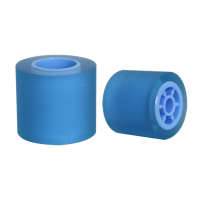

# robot_wheels
Dimensions of common tire options for robots

| Wheel | Brand     | Reference     | Material | Outer diameter | Inner diameter | Width |
|-------|-----------|---------------|----------|----------------|----------------|-------|
|                                   | Konica    | AF03-0081     | Silicone | 21             | 12.5           | 23.5  |
|                                   | Ricoh     | AF03-0090     | Silicone | 21             | 12.5           | 23.5  |
|    | Konica    | AF03-1082     | Silicone | 24.5           | 16             | 24    |
|    | Konica    | AF03-2080     | Silicone | 28             | 17             | 24    |
|        | Scaleauto | SC-4802       | Foam     | 30             | 20             | 20    |
|        | Kyosho    | MZW2-20       | Rubber   | 24.7           | 20             | 8.5   |
|                                   | Kyosho    | MZW19-30      | Rubber   | 23.9           | 20             | 8.5   |
|                                   | Kyosho    | MZ-001-N10SLA | Rubber   | 24.7           | 20             | 8.5   |
|                                   | Wltoys    | WLT K969      | Rubber   | 26.5           | 22.5           | 9/11  |
